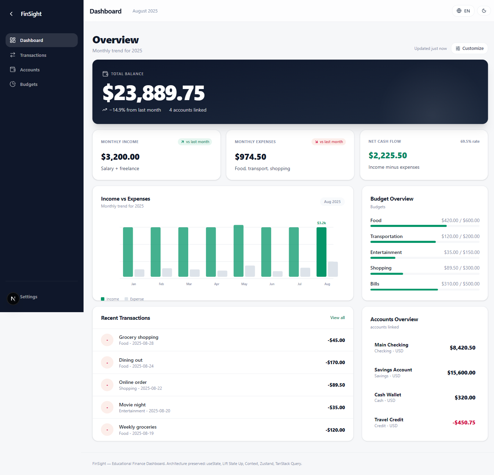
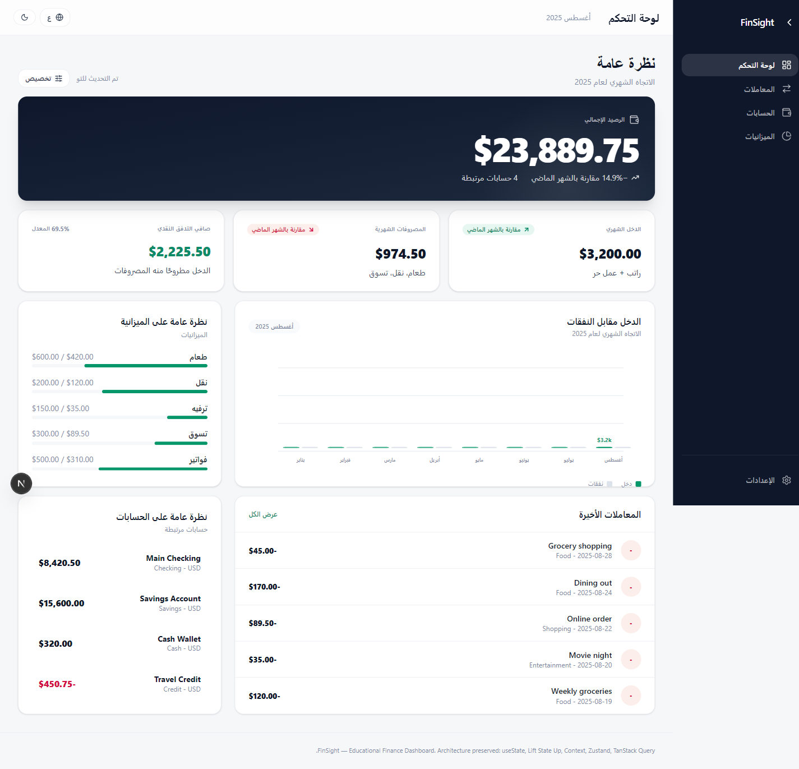

# FinSight — Personal Finance Dashboard

**Live Demo:** https://tryfinsight.vercel.app

A responsive personal finance dashboard built with **Next.js 15**, **TypeScript**, and a deliberate multi-layer state management architecture. This project demonstrates practical use of Context API, Zustand, and TanStack Query side-by-side — each serving a distinct architectural purpose.

> **Note:** All financial data is mock/static. No real banking integrations, no external APIs, no authentication required.

---

## Features

| Area | Details |
|------|---------|
| 📊 **Dashboard** | Balance overview, income vs expenses bar chart (SVG), budget progress bars, recent transactions |
| 💸 **Transactions** | Filterable/searchable list via TanStack Query; creation via `POST /api/transactions` + `useMutation` with query invalidation |
| 🏦 **Accounts** | Account balances served from `/api/accounts` and updated by new transactions |
| 📅 **Budgets** | Per-category limits with spent amounts derived from real transaction data |
| 🌐 **i18n** | Full English / Arabic UI with RTL layout switching |
| 🎨 **Theme** | Light / Dark mode toggle persisted in context |
| 📱 **Responsive** | Mobile-first layout with collapsible sidebar and bottom navigation |
| ✅ **Forms** | Transaction form (type/amount/category/account/date/note) with React Hook Form + Zod; valid submissions persist via the mock API |

---

## Tech Stack

| Technology | Role |
|-----------|------|
| **Next.js 15** | App Router, React Server Components, API routes |
| **React 19** | UI framework |
| **TypeScript** | End-to-end type safety |
| **Tailwind CSS v4** | Utility-first styling |
| **Context API** | Theme (light/dark) and i18n locale — local shared state |
| **Zustand** | Dashboard UI preferences (widget order, sidebar, compact mode) — global persistent state |
| **TanStack Query v5** | Queries for transactions/accounts/budgets/summary + `useMutation` for creation with invalidation — server/async state |
| **React Hook Form v7** | Transaction form state and submission |
| **Zod** | Schema validation for the transaction form |
| **Recharts** | Dependency available; SVG chart currently used inline for full RTL compatibility |
| **Lucide React** | Icons |
| **Storybook** | Component development and documentation |
| **Vitest** | Unit testing |

---

## State Management Architecture

This project intentionally demonstrates multiple state patterns:

```
┌──────────────────────────────────────────────────────────────────┐
│  Pattern          │  Library          │  What it manages          │
├──────────────────────────────────────────────────────────────────┤
│  Local state      │  useState         │  Filter inputs, form       │
│                   │                   │  visibility toggle         │
├──────────────────────────────────────────────────────────────────┤
│  Lifted state     │  Props / Context  │  Filters shared between    │
│                   │                   │  TransactionFilters and     │
│                   │                   │  TransactionSummary        │
├──────────────────────────────────────────────────────────────────┤
│  Global state     │  Context API      │  Theme, locale/language    │
│                   │  (ThemeContext,    │                            │
│                   │   I18nContext)     │                            │
├──────────────────────────────────────────────────────────────────┤
│  Persistent UI    │  Zustand          │  Sidebar collapsed state,  │
│  state            │  + persist()      │  widget order, compact     │
│                   │                   │  mode, selected period     │
├──────────────────────────────────────────────────────────────────┤
│  Server / async   │  TanStack Query   │  Queries for transactions /   │
│  state            │                   │  accounts / budgets / summary │
│                   │                   │  + useMutation (POST) with    │
│                   │                   │  invalidation on success      │
└──────────────────────────────────────────────────────────────────┘
```

---

## Getting Started

### Prerequisites

- Node.js 18+
- npm 9+

### Installation

```bash
git clone https://github.com/Mahmoud0A/finance-dashboard.git
cd finance-dashboard
npm install
```

### Development

```bash
npm run dev
# App runs at http://localhost:3000
```

### Type Check

```bash
npm run type-check
```

### Lint

```bash
npm run lint
```

### Tests

```bash
npm test
```

### Production Build

```bash
npm run build
npm start
```

### Storybook

```bash
npm run storybook
# Runs at http://localhost:6006
```

---

## Project Structure

```
├── src/app/                  # Next.js App Router pages + API routes
│   ├── api/                  # Route handlers (transactions, accounts, budgets, dashboard-summary)
│   ├── transactions/page.tsx
│   ├── accounts/page.tsx
│   ├── budgets/page.tsx
│   └── settings/page.tsx
├── features/                 # Feature-scoped components
│   ├── dashboard/            # DashboardPage with charts + summaries
│   ├── transactions/         # TransactionsPage, TransactionForm, TransactionRow, Filters, Schema
│   ├── accounts/             # AccountCard
│   └── budgets/              # BudgetProgress
├── shared/components/        # Reusable: AppShell, Sidebar, TopBar, MobileNav, Card, Button, Input
├── stores/                   # Zustand: dashboardStore.ts
├── contexts/                 # ThemeContext.tsx
├── lib/
│   ├── i18n/                 # I18nContext + en.json + ar.json
│   └── mockData.ts           # Mock financial data + types
└── __tests__/                # Vitest unit tests
```

---

## Screenshots

Live demo: https://tryfinsight.vercel.app





---

## Limitations

- All financial data is mock data served by Next.js API routes. Transaction creation works end-to-end (POST + in-memory update + invalidation), but mutations are not persisted across redeploys or serverless instance recycles.
- No authentication or user accounts.
- Recharts is installed as a dependency; the current income chart uses inline SVG for reliable RTL rendering. Recharts integration can be added without architectural changes.
- Language preference is not persisted across page refreshes (intentional: demonstrates in-session Context state vs. Zustand persistence).

---

## License

MIT
